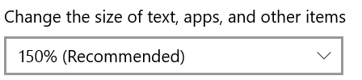
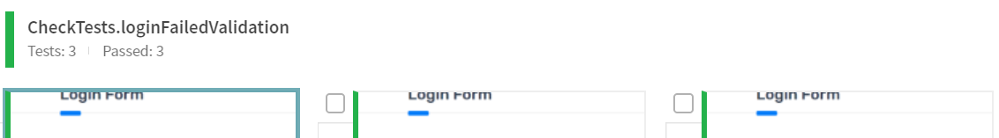
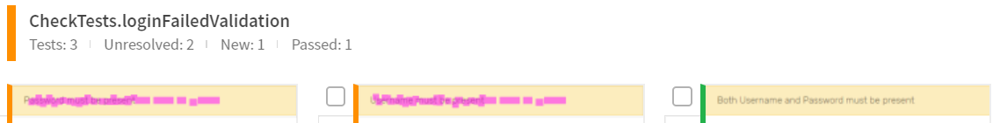
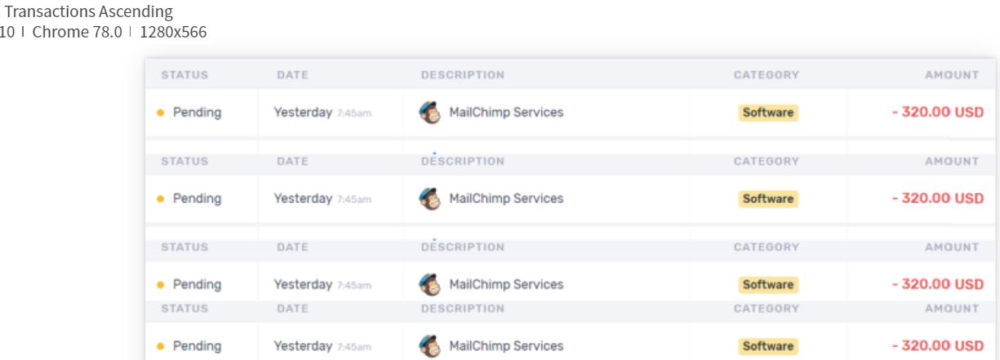
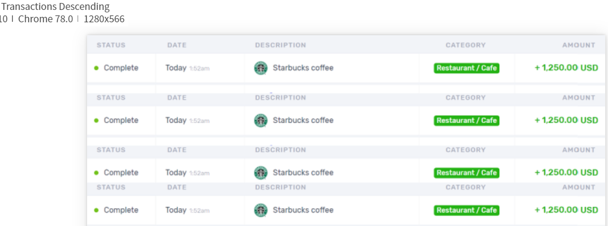
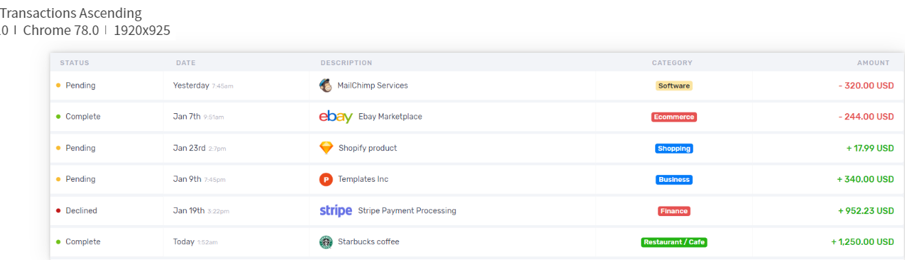
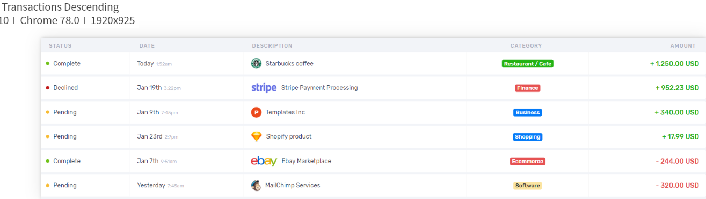

# NoDriverTests
If skip eyes().open(DRIVER, "App name", "Batch") method will throw NullPointerException instead of reasonable message that no driver setup or no open method calls. 
java.lang.NullPointerException

# ZoomTests
For my Windows machine Zoom level 150% is recommended 
 
In this case both tests in this set provides wrong images in Applitools Web Application

## loginFailedValidation
 
instead of correct 

## sortTableValidation
 
 
instead of correct 
 

# ScrollTests
If you scroll browser screen for example to element before call eyes().check(...) then element image will be wrong

# LoginCheckTests
6 same tests but for some of them failed with Applitools 
1. All three check, checkElement and checkRegion will fail for PageObjects elements (elements that initialized by **org.openqa.selenium.support.PageFactory.initElements(...)** method) 
With error **com.applitools.eyes.EyesException: The input web element is not a RemoteWebElement.** 
2. eyes().checkElement(By.cssSelector(".auth-header")) will fail with message **java.lang.IllegalArgumentException: height < 0** while same calls for check(...) or checkRegion(...) will pass